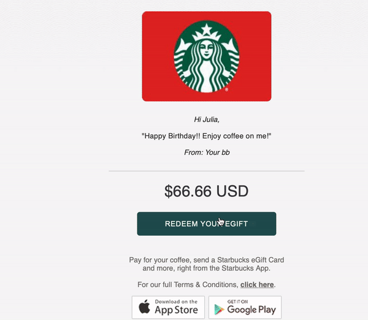

# Prank-email-template
--------
## What is it? Why would you use it?

This repo is an easy tutorial to show you how to customize an email to prank your friends. :wink: 

I used it to prank my friends on April Fool's Day, and we had fun!

*"It will only take you 2 minutes"* :boy:

------
## Disclaimer

Please don't make the others mad or carry out malicious pranks. The creator and the contributors of this repo would not be responsible for your broken friendships :dizzy_face:

------
## Instructions

1. Download the code from this page and unzip
2. Pick a `.html` file to be your email template
3. Open the `.html` file using a browser to see what you would like to change
4. Use a text editor to open the `.html` file, and search for what you would like to change
5. Make changes and save
6. Refresh the browser, then copy and paste the customized template to your email, and send
7. :tada: You are done!! :tada: 

-----
## More Templates Pls

*I am not a front-end expert* :sweat_smile:
Basically I only know copy and paste html. Feel free to contribute more `.html` email templates to this repo for sharing the joy!!
